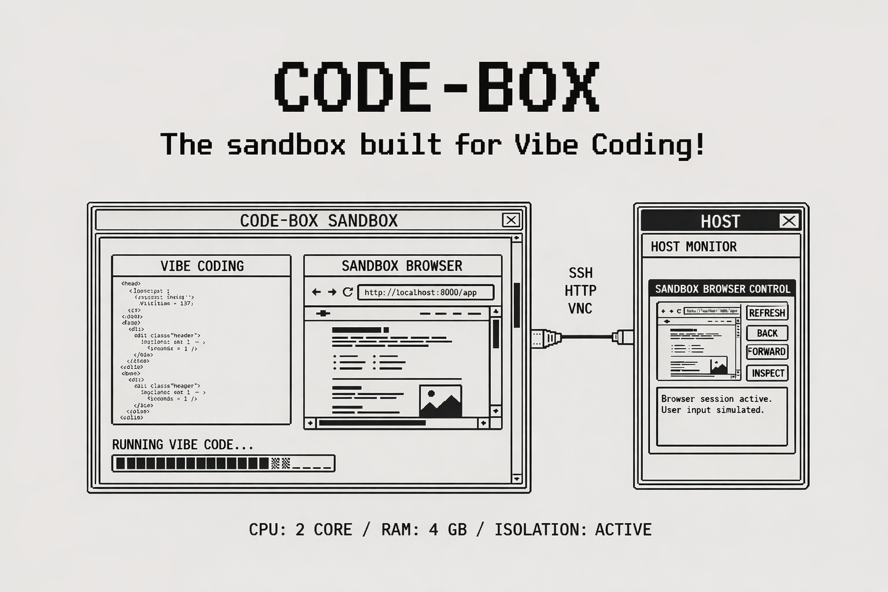

# Code-Box

<p align="center">
  
</p>

本地文件被误删？pip依赖冲突？本地端口占用？browser use干扰了正常工作？Code-Box一次解决所有这些问题！

**Code-Box** - 为Vibe Coding而生的沙盒环境!

- 免费且完全开源！
- 一键安装，开箱即用
- 容器级Coding Agent运行时环境隔离，认证信息之类该复用的复用
- 内置cc、oh-my-opencode、codex等工具
- 0day 跟进Vibe Coding工具最新版本
- 沙盒内带浏览器，同时支持你直接在本地操作沙盒内浏览器，就像Manus一样

[English](README.md) | 简体中文

## 一键安装

```bash
curl -fsSL https://raw.githubusercontent.com/nezhazheng/code-box/main/install.sh | bash
```

安装脚本会：
- 下载 `code-box` 命令到你的 PATH
- 自动配置 PATH（支持 bash、zsh、fish 等常见 shell）
- 拉取最新的 Docker 镜像
- 创建配置目录

**自动更新**：`code-box` 命令会每 24 小时自动检查更新，发现新版本时自动升级，无需手动操作。

安装完成后，可以在任何目录使用 `code-box` 命令：

```bash
cd /path/to/your/project
code-box              # 启动容器
code-box --list       # 列出所有项目和端口
code-box --help       # 显示帮助
```

## 功能特性

### 预装的 Vibe Coding 工具

- **Claude Code** - Anthropic 官方的 Claude AI 命令行工具
- **Codex** - OpenAI 强大的代码生成 AI（通过 OpenAI CLI）
- **Gemini CLI** - Google 的 Gemini AI 代码助手
- **oh-my-opencode** - OpenCode AI 编程助手
- **GitHub Copilot CLI** - GitHub 的 AI 命令行助手
- **Playwright + Chromium** - 浏览器自动化，用于测试和爬虫

### 系统能力

- **基础系统**: Ubuntu 22.04 LTS
- **编程语言**: Node.js 20, Python 3.10
- **图形界面**: Xvfb, Openbox 窗口管理器, VNC, noVNC 网页界面
- **安全性**: 非 root 用户 (developer)，支持 sudo 访问
- **资源控制**: 可配置 CPU、内存和共享内存限制

## 快速开始

```bash
curl -fsSL https://raw.githubusercontent.com/nezhazheng/code-box/main/install.sh | bash
```

然后在任意项目目录使用：

```bash
cd ~/myproject
code-box
```

### 访问沙盒内的浏览器

Code-Box 自动为每个项目分配随机端口并记住它们：

```bash
# 列出所有项目及其端口
code-box --list

# 示例输出：
#   code_box_myproject
#     Path:   /home/user/myproject
#     VNC:    localhost:12345
#     noVNC:  http://localhost:23456/vnc.html
```

noVNC的地址直接粘贴到你的本地浏览器中就能操作沙盒内的浏览器啦！

## 使用示例

### 使用 Claude Code

```bash
# 在容器内
cd ~/workspace
claude "explain this codebase"
claude "refactor this function to be more efficient"
```

### 使用 GitHub Copilot CLI

```bash
# 获取命令建议
github-copilot-cli what-the-shell "find all python files modified in last week"

# 获取 git 命令帮助
github-copilot-cli git-assist "undo last commit but keep changes"
```

### 使用 Codex (OpenAI)

```bash
# 使用 OpenAI CLI 生成代码
export OPENAI_API_KEY="your-api-key-here"

# 生成代码
openai api completions.create \
  -m gpt-3.5-turbo-instruct \
  -p "Write a Python function to calculate fibonacci numbers"
```

### 使用 Gemini CLI (Google)

```bash
# 设置 Gemini API key
export GOOGLE_API_KEY="your-api-key-here"

# 使用 Gemini 进行代码辅助
python3 -c "
from google import generativeai as genai
genai.configure(api_key='your-api-key')
model = genai.GenerativeModel('gemini-pro')
response = model.generate_content('Write a React component for a todo list')
print(response.text)
"
```

### 使用 oh-my-opencode

```bash
# 启动 oh-my-opencode
cd ~/workspace/myproject
oh-my-opencode

# 按照交互式提示进行 AI 辅助编程
```

### 使用 Playwright

```bash
# Python 示例
python3 << 'EOF'
from playwright.sync_api import sync_playwright

with sync_playwright() as p:
    browser = p.chromium.launch()
    page = browser.new_page()
    page.goto("https://example.com")
    print(page.title())
    browser.close()
EOF
```

## 命令

```bash
# 启动或连接到容器（在任意项目目录）
code-box

# 停止容器
code-box --stop

# 删除容器
code-box --remove

# 查看容器日志
code-box --logs

# 列出所有项目及其端口
code-box --list

# 拉取最新 Docker 镜像
code-box --pull

# 更新 CLI 和 Docker 镜像
code-box --update

# 查看版本
code-box --version

# 清理所有已停止的容器
code-box --clean

# 显示帮助
code-box --help
```

## 配置

### 配置目录

Code-Box 将配置存储在 `~/.code-box/`：

```
~/.code-box/
└── ports.json    # 项目到端口的映射
```

### 资源限制

编辑 `code-box` 脚本或设置环境变量：

```bash
MEMORY_LIMIT="4g"      # RAM 限制
CPU_LIMIT="2"          # CPU 核心数
SHM_SIZE="2g"          # 共享内存（Chromium 需要）
```

### 卷挂载

默认情况下，脚本挂载：
- 当前目录 → `/home/developer/workspace`
- `~/.claude_config_docker` → `/home/developer/.claude`（Claude Code 配置，与宿主机隔离）

在 `run-codebox.sh` 中添加更多卷：

```bash
-v "/path/on/host:/path/in/container"
```

### 端口分配

Code-Box 使用自动端口分配机制：

- 端口范围：10000-60000（随机分配）
- 每个项目的端口分配是持久化的
- 端口映射存储在：`~/.code-box/ports.json`
- 查看端口：运行 `code-box --list`

每次启动容器时，Code-Box 会自动分配可用端口，避免端口冲突。

## 卸载

### 完全卸载 Code-Box

如需完全卸载 Code-Box，按以下步骤操作：

```bash
# 1. 停止并删除所有 code_box 容器
code-box --clean

# 2. 删除 Docker 镜像
docker rmi nezhazheng/code-box:latest

# 3. 删除配置目录
rm -rf ~/.code-box

# 4. 删除 code-box 命令（可能需要 sudo）
sudo rm /usr/local/bin/code-box
# 或者，如果安装在其他位置
which code-box | xargs rm
```

### 仅删除特定项目的容器

如果只想删除某个项目的容器：

```bash
# 在项目目录下
cd /path/to/your/project
code-box --remove
```

## 使用场景

1. **多工具 AI 开发**
   - 比较不同的 AI 编程助手
   - 为每个任务使用最佳工具
   - 实验各种 AI 工作流

2. **安全实验**
   - 在隔离环境中测试 AI 生成的代码
   - 避免污染主系统
   - 轻松清理和重置

3. **浏览器自动化**
   - 使用 Chromium 运行 Playwright 脚本
   - 无头或有头（通过 VNC）测试
   - 网页爬取和自动化

4. **团队协作**
   - 一致的开发环境
   - 共享 AI 工具配置
   - 可复现的设置

5. **CI/CD 集成**
   - 使用 AI 自动化代码审查
   - AI 辅助测试
   - 代码质量检查

## 系统要求

- Docker Desktop 或 Docker Engine
- 4GB+ 可用 RAM（可配置）
- 2+ CPU 核心（可配置）
- ~5GB 磁盘空间用于镜像

## 许可证

MIT License - 详见 [LICENSE](LICENSE) 文件。

## 贡献

欢迎贡献！请随时提交 issues 或 pull requests。

## 资源

- [Claude Code 文档](https://github.com/anthropics/claude-code)
- [GitHub Copilot CLI](https://githubnext.com/projects/copilot-cli/)

## 支持

遇到问题、疑问或建议：
- 在 GitHub 上提交 issue
- 查看各工具的文档
- 查看容器日志：`code-box --logs`

---

**Code-Box** - 为Vibe Coding而生的沙盒环境。
